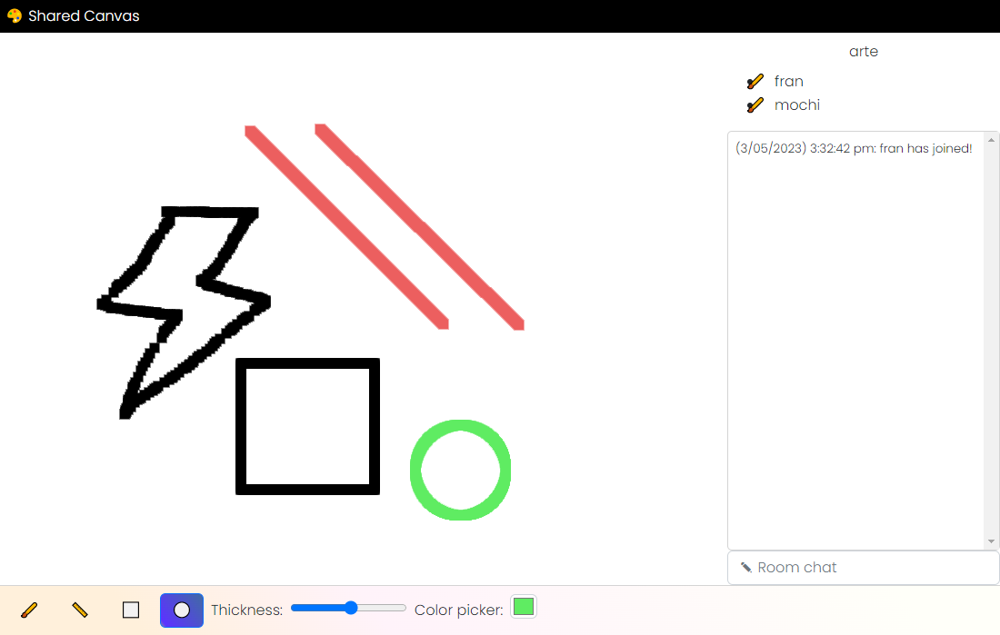

# Shared Canvas

This project is a collaborative tool for designing, built using Elixir and Phoenix. Its purpose is to provide a platform for multiple users to draw on a shared canvas in real time. The project was created as a means of learning Elixir and exploring the use of Phoenix.

## Technologies used

- Elixir, Phoenix, Redis, HTML, CSS, JavaScript

## Features

- Enter a chat lobby with a unique nickname (no authentication)
- Join a room with up to 5 people and draw collaboratively on a canvas
- Chat with others in the same room
- Basic pencil and coloring tools for drawing on the canvas
- Nicknames and drawing data are stored in Redis

## Demo

[//]: # (- www.sharedcanvas.io)

- To be implemented

## Screenshots

  

## Usage

- Enter a nickname
- Enter a room with an entry code
- Draw

## Challenges

- Learning a new language (Elixir)
- Understanding Phoenix conventions
- Adapting to new paradigms such as sockets and channels
- Limited documentation due to being a relatively new language

## Future Work

- Addition of more drawing tools such as brushes and vector
- Ability to save and load drawings
- More collaboration tools such as voice chat
- Further optimization and refactoring of code
- Improved UI/UX design

## Credits

- [Official Phoenix tutorial](https://hexdocs.pm/phoenix/overview.html)